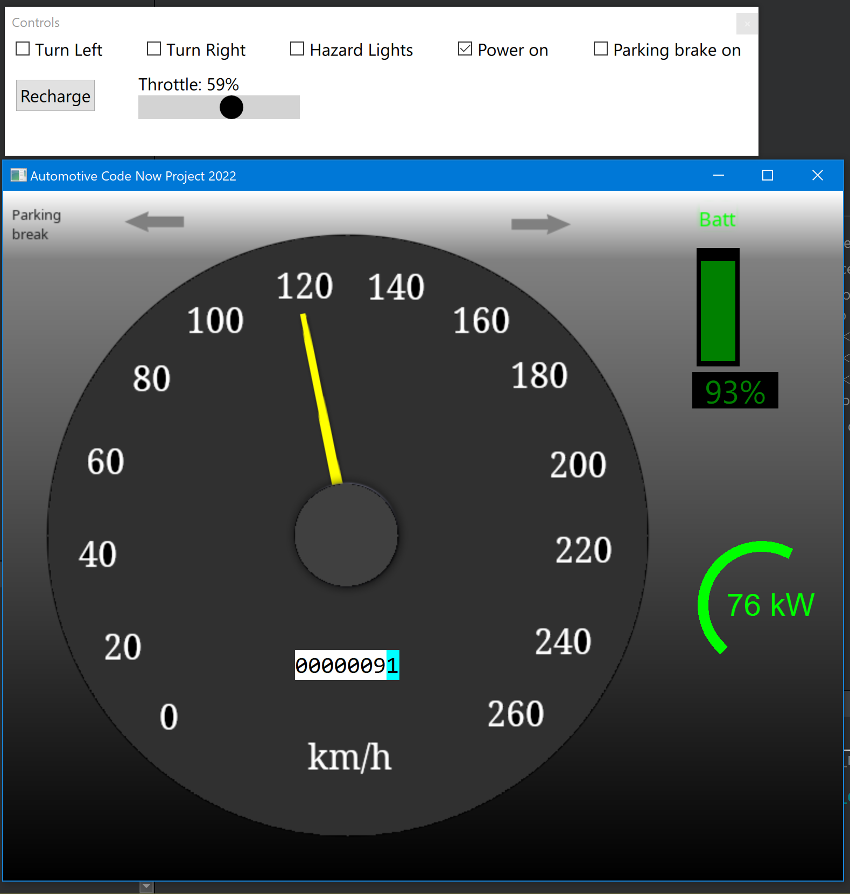

# Projects

## QuickApp

Speedgauge simulation with Qt Quick.  

## RemoteObjects

Qt Remote Objects experiment to demo interprocess messaging.

# Development Environment

* Windows 10
* Qt 6.2.4  (open source license)
  * MinGW 11.x
  * Qt Quick 3D
  * Qt 5 Compability Module
  * Qt Shader Tools
  * Qt Multimedia (for audio dev)
  * Qt Remote Objects (for RO dev)
  * Qt Virtual Keyboard
  * Qt Debug Information Files
  * Qt Quick Timeline
* Qt Creator 7.0.1

# References

[Newton's laws of motion](https://en.wikipedia.org/wiki/Newton's_laws_of_motion)  
[Kinetic energy](https://en.wikipedia.org/wiki/Kinetic_energy)  
[Drag](https://en.wikipedia.org/wiki/Drag_(physics) )  
[Electric power](https://en.wikipedia.org/wiki/Electric_power)  
[Kilowatt-hour](https://en.wikipedia.org/wiki/Kilowatt-hour)  
[Qt Remote Objects](https://doc.qt.io/qt-6/qtremoteobjects-index.html#qt-remote-objects)  
