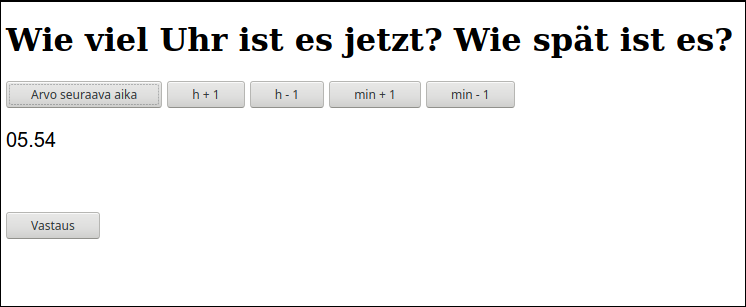

# Sisältö

### jarjestyslukuja.txt, verbeja.txt

Esimerkkitiedostot [StudyCards-ohjelmaan](../studycards). Tallennettu tekstitiedostoina UTF-8-formaatissa.  

Sisällön formaatti:  
asia opiskeltavalla kielellä <TAB> asia suomeksi <ENTER>  
asia opiskeltavalla kielellä <TAB> asia suomeksi <ENTER>  
jne ...

### uhrzeit.html

Kellonaikoja saksaksi. Normaalisti arvotaan aika ja mietitään vastausta. Vastaus-napista nähdään vastaus. 
Napeista voi askeltaa tunti eteen- ja taaksepäin, samoin minuutteja. Taas Vastaus-napista nähdään vastaus.

