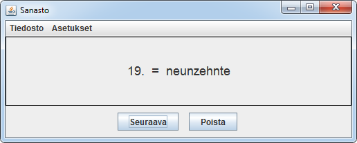
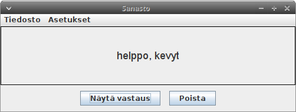
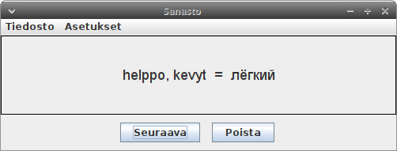

# StudyCards



Apuohjelma kielten sanaston opiskeluun vuodelta 2007. Tehty Java 1.5:lla (Swing UI). Pikaisesti muokattu lukemaan UTF-8-tekstitiedostoja sisään. 
Todettu kääntyväksi virheilmoituksitta OpenJDK versiolla 11 (Linux), Oraclen JDK versiolla 10 (Linux) ja Oraclen JDK versiolla 13 (Windows).
Esimerkkisanastoja [saksaksi](../saksa) ja [venäjäksi](../venaja).

# Sisältöä

build.bat: käännä Java-tiedostot, tee .jar (Windows). Java:n bin-hakemisto oltava PATH-muuttujassa.  
*.java : lähdekooodit  
Makefile: GNU Maken suoritusohjeet Java-tiedostojen kääntämiseksi (Linux). Riittää komento ```make```  
run.bat: suorita Java-ohjelma (Windows). Java:n bin-hakemisto oltava PATH-muuttujassa.  
run.sh: suorita Java-ohjelma (Linux)  

# Käyttöliittymä

Aluksi ohjelma on tyhjä, sanasto luetaan sisään Tiedosto-valikon toiminnon kautta. 
Kyselyn suuntaa voi vaihtaa (milloin vain) Asetukset-valikosta. Asetus vaikuttaa seuraavaan kysymykseen.
Ohjelman voi sulkea nurkasta. Ohjelma arpoo listalta vastinpareja satunnaisesti. Listan sekoitus tehdään alussa. 
Kyselyn aikana järjestys on kiinteä. Ikkunan kokoa voi muuttaa, tai muokata lähdekoodista aloituskokoa sopivaksi.



**Näytä vastaus** näyttää vastauksen, **Poista** poistaa vastinparin listalta heti ja kysyy seuraavan.
**Seuraava** kysyy seuraavan vastinparin poistamatta sitä listalta, jota kierretään ympäri.  

Logiikka:  
**Seuraava**: painetaan, jos ei muisteta kysyttyä asiaa. Ohjelma kysyy kohta uudestaan.  
**Poista**: painetaan, jos muistetaan kysytty asia. Ei kysytä enää.



Tenttaaminen loppuu, kun lista on tyhjä. Silloin ilmestyy **Loppu**.


