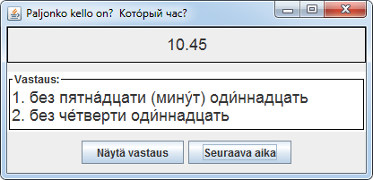

# Sisältö

### adjektiiveja.txt

Esimerkkitiedosto [StudyCards-ohjelmaan](../studycards). Tallennettu tekstitiedostona UTF-8-formaatissa.  

Sisällön formaatti:  
asia opiskeltavalla kielellä <TAB> asia suomeksi <ENTER>  
asia opiskeltavalla kielellä <TAB> asia suomeksi <ENTER>  
jne ...  

Vokaalinpainot: esim. **большо́й**,  о ja perään Unicode-merkki U+0301 : COMBINING ACUTE ACCENT (U+769 desimaalisena).

### Clock.class, lähdekoodina Clock.java

Apuohjelma venäjän kellonaikojen opiskeluun vuodelta 2007. Tehty Java 1.5:lla (Swing UI). 
.class käännetty virheilmoituksitta OpenJDK versiolla 11 (Linux) ja Oraclen JDK:lla (versio 13 Windows).

Arpoo napista kellonajan. Mietityn fraasin voi tarkistaa toisesta napista. Kellonajan kohdalta voi hiiren napeilla
 siirtää tunteja ja minuutteja eteenpäin. Sama rullalla mutta nyt myös voi aikaa siirtää edestakaisin.

### numbers: NumberView, Number

Apuohjelma venäjän numeroiden opiskeluun.  
Kääntyy virheilmoituksitta OpenJDK versiolla 11 ja Oraclen JDK versiolla 10 (Linux).  
Arpoo napista numeron ja näyttää sen tekstinä.

NumberView: käyttöliittymä /pääohjelma  
Number: tekee luvusta tekstimuodon

