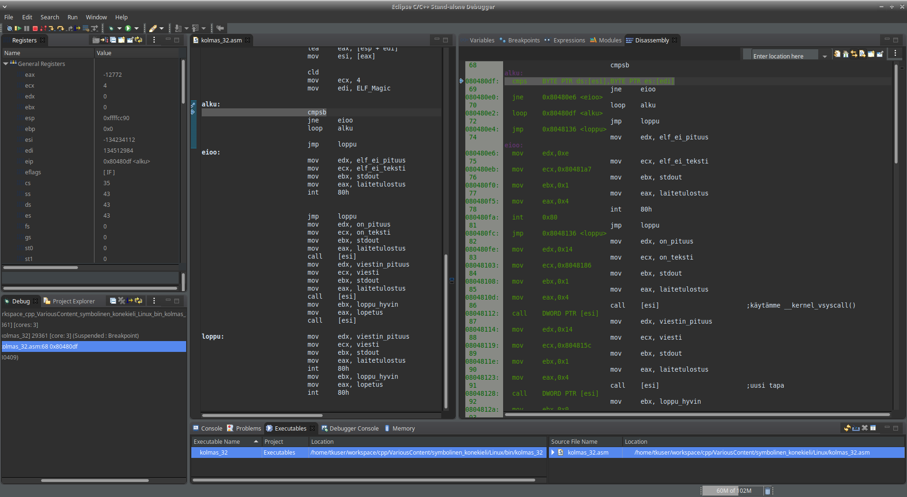

# Yleistä

Ubuntu 18.04 LTS (64-bit)  
Netwide Assembler [NASM](https://nasm.us/ "nasm") v. 2.14.02 Stable  
Linkkeri: GNU ld (GNU Binutils for Ubuntu) 2.30  

[GNU Project debugger ohjetta](http://sourceware.org/gdb/download/onlinedocs/gdb/index.html)  
[Eclipse Stand-alone C/C++ GDB Graphical Debugger](https://www.eclipse.org/cdt/downloads.php)  

### Dokumentit  

[Sample nasm programs](https://www.csee.umbc.edu/portal/help/nasm/sample.shtml )  

[Agner Fog blogi](https://www.agner.org/optimize/)  
[System V Application Binary Interface](https://github.com/hjl-tools/x86-psABI/wiki/X86-psABI)  
[AMD](https://www.amd.com/en/support/tech-docs)  
[Intel](https://software.intel.com/en-us/articles/intel-sdm)


# Eclipse Stand-alone C/C++ GDB Graphical Debugger



Toimii, hieman tahmea käynnistys; Java-pohjainen??  
Konfiguroitavissa: värit, ikkunat, ...  
Toimii parhaiten käynnistämällä ilman parametreja, ja hakee binäärin käynnistysdialogiin. Debuggerissa avataan lähdekoodi lisäksi. 
Lähdekoodin hakupolkuja voi määritellä myös.

Intel-syntaksi GDB:ssä:  
Kotihakemistoon tiedosto .gdbinit, johon rivi: set disassembly-flavor intel  

Intel-syntaksi myös Eclipsen C/C++ debuggeriin:  
Window: Preferences, sieltä C/C++: Debug: GDB. Debug Configuration Defaults, kenttä: GDB command file. 
Browse:lla haetaan .gdbinit. Ilmestyy koko polku tiedostoon. Pelkkä .gdbinit kentässä ei riitä.


Koko [Eclpse CDT](https://www.eclipse.org/cdt/) softan debuggeri toiminnee samoin.

# 32-bittinen kehitys 64-bittisellä alustalla

Systeemikutsujen numerot: /usr/include/x86_64-linux-gnu/asm/unistd_32.h  
Paketit: gcc-multilib libc6-dev-i386  

Komentoriviparametrit:  
1. assembler nasm: -w +all -f elf32 -g -F dwarf -l listaus.lst -o objektitiedosto.o lähdekoodi.asm  
2. linker ld: -m elf_i386 objektitiedosto(t) -o binääri --Map tiedosto.map -dynamic-linker /lib/ld-linux.so.2

### eka_32.asm

Tulostetaan tekstiä (UTF-8) käyttäen perinteistä ohjelmistopohjaista keskeytystä int 80h.  
Ei käytetä GNU C-kirjastoa glibc:  
```Shell Session
$ ldd eka32
   not a dynamic executable
```
Ei näy: linux-gate.so.1

### toka_32.asm

Haetaan vDSO:n (virtual dynamic shared object) tarjoama funktio __kernel_vsyscall().  
Tulostetaan tekstiä sitä käyttäen. Käytetaan funktion haussa tunnistetta AT_SYSINFO.  
Ei käytetä GNU C-kirjastoa glibc:  
```Shell Session
$ ldd toka_32
   not a dynamic executable
```
Ei näy: linux-gate.so.1  

Hyödylliset linkit:  
[Linux Programmer's Manual - VDSO](http://man7.org/linux/man-pages/man7/vdso.7.html)  
[About ELF Auxiliary Vectors](http://articles.manugarg.com/aboutelfauxiliaryvectors.html)  
[Anatomy of a system call, part 2](https://lwn.net/Articles/604515/)  
[The Definitive Guide to Linux System Calls](https://blog.packagecloud.io/eng/2016/04/05/the-definitive-guide-to-linux-system-calls/)  
The flat assembler Message Board: [[Linux32] vDSO, auxv, vsyscall, int 0x80, calling the kernel](https://board.flatassembler.net/topic.php?t=20926)


