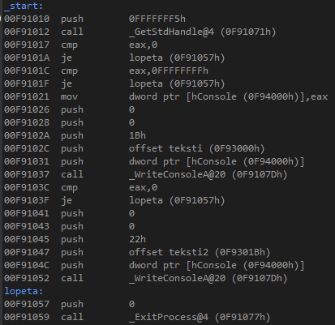

# Yleistä

Windows 7 SP1 (64-bit)  
Visual Studio 2019  
   * 32-bit: Microsoft Macro Assembler Version 14.24.28316.0
   * 64-bit: Microsoft Macro Assembler (x64) Version 14.24.28316.0

### Muita assemblereita

[as - the GNU assembler, MSYS2](https://www.msys2.org/)  
[Asmc Macro Assembler](https://github.com/nidud/asmc)  
[EuroAssembler](https://euroassembler.eu/eadoc/)  
[flat assembler](http://flatassembler.net/download.php)  
[GoAsm](http://www.godevtool.com/)  
[JWasm](https://github.com/JWasm/jwasm.github.io)  
[MASM32 SDK](https://www.masm32.com/)  (ei Microsoftin tuotos)  
[NASM](https://nasm.us/)  
[Open Watcom Assembler](http://openwatcom.org/download.php)  
[Pelles Macro Assembler](http://www.smorgasbordet.com/pellesc/)  
[Solar Assembler](http://www.oby.ro/sol_asm/)  
[UASM](http://www.terraspace.co.uk/uasm.html)  

[Easy Code - Visual Assembler](http://www.easycode.cat/English/Help/EasyCode.htm)  
[Visual MASM](http://www.visualmasm.com/)  

Kykenevät luomaan .exen ilman linkeriä: Asmc, EuroAssembler, flat assembler, JWasm, Solar Assembler, UASM

### Muita linkereitä

[GoLink](http://www.godevtool.com/)  
[JWlink](https://github.com/JWasm/jwasm.github.io)  
[ld - The GNU linker, MYS2](https://www.msys2.org/)  
[lld](https://releases.llvm.org/)  
[Open Watcom Linker](http://openwatcom.org/download.php)  
[Pelles Linker polink](http://www.smorgasbordet.com/pellesc/)  

### Muita debuggereita

[Eclipse CDT/Standalone Debugger](https://www.eclipse.org/cdt/downloads.php)  
[GDB the GNU Debugger, MSYS2](https://www.msys2.org/)  
[GoBug ](http://www.godevtool.com/)  
[OllyDbg](http://www.ollydbg.de/)  
[Open Watcom Debugger](http://openwatcom.org/download.php)  
[x64dbg](https://x64dbg.com/)

### Muut

[Matt Godbolt's Compiler Explorer](https://godbolt.org/)  
[Free Code Manipulation Library](http://www.fcml-lib.com/)  
[ModernUI](https://github.com/mrfearless/ModernUI64)  

### Dokumentit

[Microsoft Macro Assembler reference](https://docs.microsoft.com/en-us/cpp/assembler/masm/microsoft-macro-assembler-reference)  
[Microsoft Macro Assembler (MASM) Unofficial Changelist](http://bytepointer.com/masm/index.htm)  
[MASM 6.0 References](https://www.pcjs.org/documents/books/mspl13/masm/)  
[Agner Fog blogi](https://www.agner.org/optimize/)  
[AMD](https://www.amd.com/en/support/tech-docs)  
[Intel](https://software.intel.com/en-us/articles/intel-sdm)  
[Windows API Index](https://docs.microsoft.com/en-us/windows/win32/apiindex/windows-api-list)  
[Calling conventions for different C++ compilers and operating systems By Agner Fog](https://www.agner.org/optimize/calling_conventions.pdf)

# 32-bittinen kehitys 64-bittisellä alustalla

[Argument Passing and Naming Conventions](https://docs.microsoft.com/en-us/cpp/cpp/argument-passing-and-naming-conventions)  
[__stdcall](https://docs.microsoft.com/en-us/cpp/cpp/stdcall)  
[__cdecl](https://docs.microsoft.com/en-us/cpp/cpp/cdecl)  
[x86 calling conventions](https://en.wikipedia.org/wiki/X86_calling_conventions)  

Muita asm-apuja  
[How to write hello world in assembler under Windows? - winapi](https://php.developreference.com/article/27378914/How+to+write+hello+world+in+assembler+under+Windows%3f)

### eka_32.asm

Tulostetaan tekstiä WriteConsoleA-funktiota käyttäen (ANSI teksti, koodisivu 1252). Ei käytetä standardi C/C++ -funktioita. 
Ääkköset: Windowsin komentokehotteeseen komento: ```chcp 1252``` ja exe:n suoritus.

### toka_32.asm

Sama kuin edellinen mutta käytään Windows API kutsuihin PROTO ja INVOKE-direktiivejä. Generoitunut koodi tarkasteltavissa debuggerissa.  



# 64-bittinen kehitys 64-bittisellä alustalla

[x64 software conventions](https://docs.microsoft.com/en-us/cpp/build/x64-software-conventions)  
[x64 calling convention](https://docs.microsoft.com/en-us/cpp/build/x64-calling-convention)  
[x86 calling conventions](https://en.wikipedia.org/wiki/X86_calling_conventions)  
[Moving to Windows Vista x64](https://www.codeproject.com/Articles/17263/Moving-to-Windows-Vista-x64)  

### eka_64.asm

Tulostetaan tekstiä WriteConsoleA-funktiota käyttäen (ANSI teksti, koodisivu 1252). Ei käytetä standardi C/C++ -funktioita. 
Ääkköset: Windowsin komentokehotteeseen komento: ```chcp 1252``` ja exe:n suoritus.
